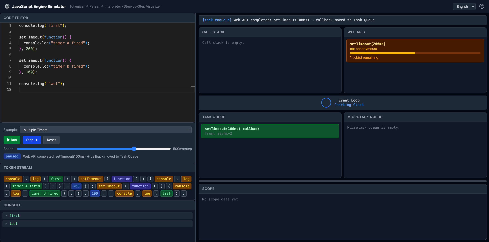

# JavaScript Engine Simulator

JavaScript가 내부적으로 어떻게 동작하는지 시각화하는 인터랙티브 시뮬레이터입니다.

[English](./README.md)



## 무엇을 하는 프로젝트인가

JavaScript 코드를 작성하면 실제 엔진 파이프라인을 따라 단계별로 실행되는 과정을 관찰할 수 있습니다:

```
소스 코드 → Tokenizer → Parser → Interpreter
```

각 단계가 실시간으로 시각화됩니다 — 토큰이 생성되고, AST가 구축되며, 콜 스택이 쌓이고 빠지고, 스코프 체인이 형성되고, 변수가 변경되는 과정을 모두 눈으로 확인할 수 있습니다.

### Sync 모드

핵심 실행 모델을 시각화합니다:

- **Tokens** — 소스 코드가 키워드, 식별자, 연산자, 리터럴로 분해되는 과정
- **AST** — 파서가 토큰으로부터 구축하는 트리 구조
- **Call Stack** — 함수 호출이 프레임을 push/pop하는 과정
- **Scope Chain** — 렉시컬 스코핑과 클로저를 통해 변수가 해석되는 과정
- **Console** — `console.log` 출력

### Async 모드

비동기 런타임 전체를 시각화합니다:

- **Web APIs** — `setTimeout`과 `fetch`가 등록되어 대기하는 영역
- **Task Queue** (Macrotask) — 타이머/네트워크 완료 후 실행 대기하는 콜백
- **Microtask Queue** — `Promise.then`, `queueMicrotask`, `await` continuation
- **Event Loop** — 콜 스택을 확인하고 올바른 우선순위로 큐를 소비하는 오케스트레이터

## 내장 스니펫

JavaScript 핵심 개념을 보여주는 15개의 코드 예제가 내장되어 있습니다. 모든 스니펫은 실제 JavaScript 엔진(V8/SpiderMonkey)과 동일한 출력을 생성합니다.

### Sync (8개)

| 스니펫            | 시연 내용                      |
| ----------------- | ------------------------------ |
| Fibonacci         | 재귀, 콜 스택 깊이             |
| Closure Counter   | 클로저, 공유 변수              |
| Arrow Function    | 화살표 문법, 고차 함수         |
| For Loop          | `for` 문, 블록 스코프          |
| Scope Demo        | 중첩 스코프 체인 탐색          |
| Conditional Logic | `if`/`else if`, `&&` 단축 평가 |
| Math              | Math 내장 객체, `while` 루프   |
| Array & Object    | 리터럴, 인덱스/프로퍼티 접근   |

### Async (7개)

| 스니펫                 | 시연 내용                                            |
| ---------------------- | ---------------------------------------------------- |
| setTimeout Demo        | Web API → Task Queue 흐름                            |
| Multiple Timers        | 짧은 delay가 먼저 실행                               |
| Microtask vs Macrotask | Microtask 큐가 Task 큐보다 우선                      |
| Promise Chain          | `Promise.resolve().then()`이 microtask 스케줄링      |
| Fetch (async/await)    | `await`이 함수를 일시 정지, microtask로 재개         |
| Multiple Await         | 순차적 await를 넘나드는 continuation 체이닝          |
| All Queues Demo        | 중첩 microtask를 포함한 Event Loop 전체 라이프사이클 |

> 각 스니펫별 상세 실행 플로우 분석: [docs/snippet-flow-analysis.md](./docs/snippet-flow-analysis.md)

## 시작하기

```bash
pnpm install
pnpm dev
```

## 라이선스

MIT
