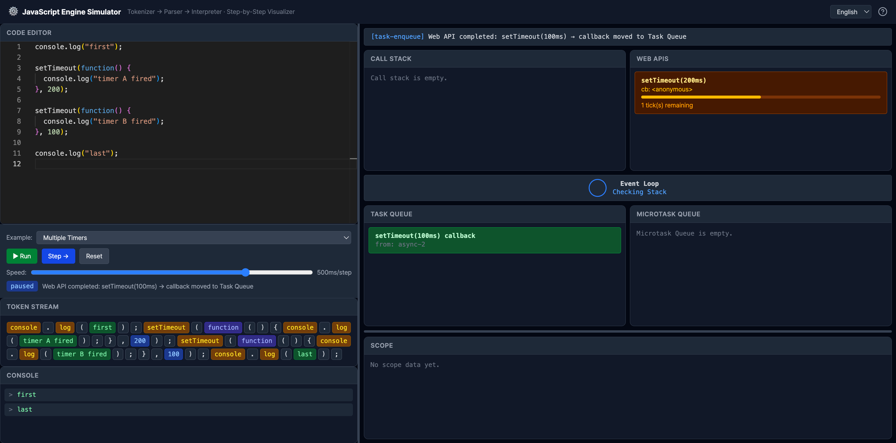
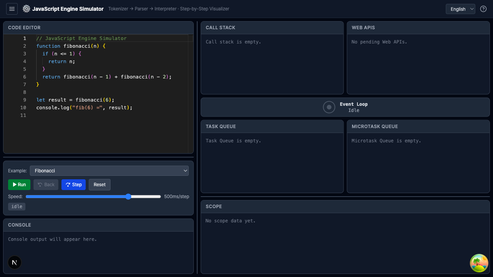
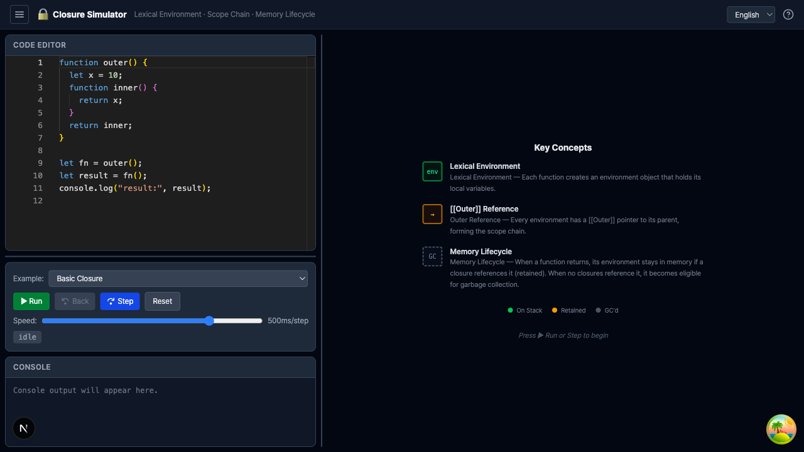
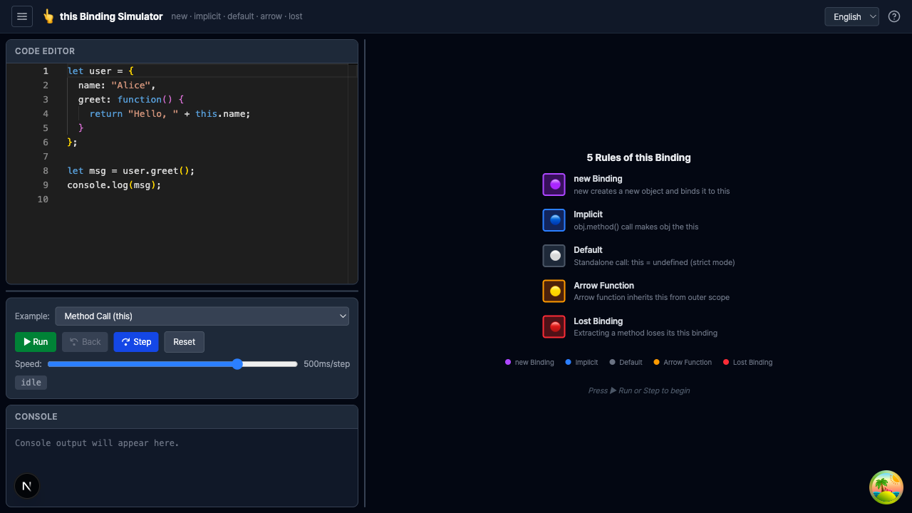
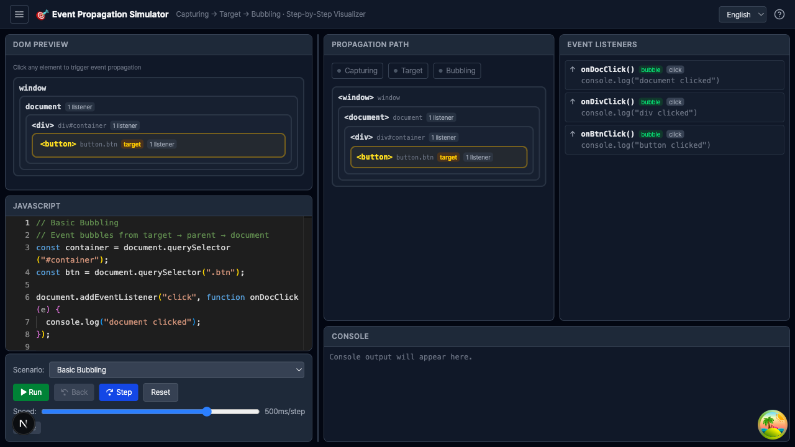
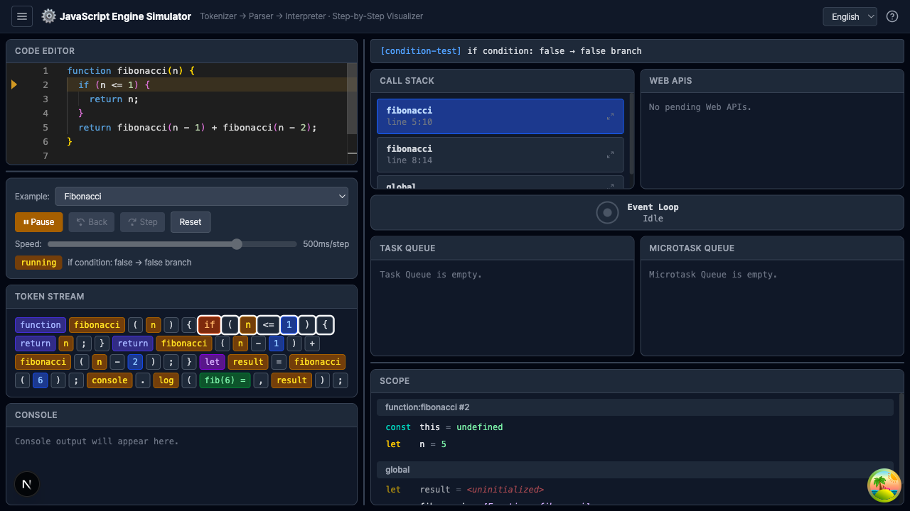
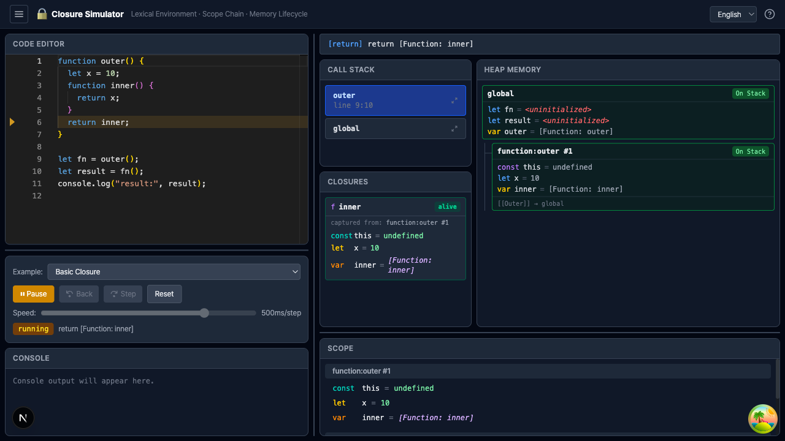
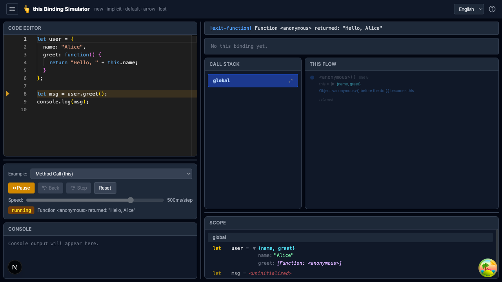
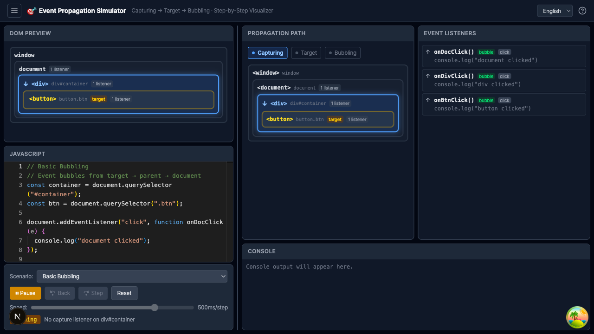

# JavaScript Engine Simulator

JavaScript가 내부적으로 어떻게 동작하는지 시각화하는 인터랙티브 시뮬레이터입니다.

[English](./README.md)



## What It Does

JavaScript 코드를 작성하면 실제 엔진 파이프라인을 따라 단계별로 실행되는 과정을 관찰할 수 있습니다:

```
소스 코드 → Tokenizer → Parser → Interpreter
```

각 단계가 실시간으로 시각화됩니다 — 토큰이 생성되고, AST가 구축되며, 콜 스택이 쌓이고 빠지고, 스코프 체인이 형성되고, 변수가 변경되는 과정을 모두 눈으로 확인할 수 있습니다.

## Simulators

|                         Engine                          |                          Closure                          |                        this Binding                         |                         Event                         |
| :-----------------------------------------------------: | :-------------------------------------------------------: | :---------------------------------------------------------: | :---------------------------------------------------: |
|  |  |  |  |
|                   동기 & 비동기 실행                    |                    힙 메모리 생명주기                     |                      `this` 규칙 감지                       |                    DOM 이벤트 전파                    |

### Engine Simulator

핵심 시뮬레이터입니다. 동기/비동기 JavaScript 실행을 시각화합니다.



**Sync 모드**는 기본 실행 모델을 시각화합니다:

- **Tokens** — 소스 코드가 키워드, 식별자, 연산자, 리터럴로 분해되는 과정
- **AST** — 파서가 토큰으로부터 구축하는 트리 구조
- **Call Stack** — 함수 호출이 프레임을 push/pop하는 과정
- **Scope Chain** — 렉시컬 스코핑을 통해 변수가 해석되는 과정
- **Console** — `console.log` 출력

**Async 모드**는 비동기 런타임 전체를 시각화합니다:

- **Web APIs** — `setTimeout`과 `fetch`가 등록되어 대기하는 영역
- **Task Queue** (Macrotask) — 타이머/네트워크 완료 후 실행 대기하는 콜백
- **Microtask Queue** — `Promise.then`, `queueMicrotask`, `await` continuation
- **Event Loop** — 콜 스택을 확인하고 올바른 우선순위로 큐를 소비하는 오케스트레이터

### Closure Simulator

클로저와 메모리 생명주기를 이해하기 위한 전용 페이지입니다.



- **힙 메모리** — 환경 객체를 active/retained/collected 상태로 시각화
- **스코프 체인** — 클로저가 외부 스코프의 변수를 캡처하는 과정
- **클로저 참조** — 어떤 클로저가 어떤 환경을 살려두는지 추적
- **GC 시각화** — 더 이상 참조되지 않는 환경이 해제되는 과정 관찰

### this Binding Simulator

호출 시점에 `this`가 어떻게 결정되는지 실시간 규칙 감지로 시각화합니다.



- **new** — `new` 키워드를 통한 생성자 호출
- **implicit** — 메서드 호출에서 `this` = 호출자 객체
- **default** — 단독 호출에서 `this` = `undefined` (strict mode)
- **arrow** — 화살표 함수가 외부 스코프의 `this`를 상속
- **lost** — 메서드를 추출하면 `this` 바인딩이 깨지는 경우

각 규칙은 소스 코드에 색상으로 표시되며 플로우 패널에서 추적됩니다.

### Event Simulator

인터랙티브 DOM 이벤트 전파 시각화 도구입니다.



- **DOM 트리** — DOM 구조를 구성하고 시각화
- **전파** — 캡처링 → 타겟 → 버블링 단계를 거치는 이벤트 흐름 관찰

## 내장 스니펫

모든 시뮬레이터에 걸쳐 29개의 코드 예제가 내장되어 있습니다. 모든 스니펫은 실제 JavaScript 엔진(V8/SpiderMonkey)과 동일한 출력을 생성합니다.

### 엔진 — 기초 (6개)

| 스니펫            | 시연 내용                      |
| ----------------- | ------------------------------ |
| Fibonacci         | 재귀, 콜 스택 깊이             |
| Closure Counter   | 클로저, 공유 변수              |
| Arrow Function    | 화살표 문법, 고차 함수         |
| For Loop          | `for` 문, 블록 스코프          |
| Scope Demo        | 중첩 스코프 체인 탐색          |
| Conditional Logic | `if`/`else if`, `&&` 단축 평가 |

### 엔진 — 데이터 & 제어 (4개)

| 스니펫           | 시연 내용                     |
| ---------------- | ----------------------------- |
| Math             | Math 내장 객체, `while` 루프  |
| Array & Object   | 리터럴, 인덱스/프로퍼티 접근  |
| Try/Catch        | 예외 처리, `finally` 정리     |
| Ternary Operator | 조건 표현식, 중첩 삼항 연산자 |

### 엔진 — 비동기 Event Loop (7개)

| 스니펫                 | 시연 내용                                            |
| ---------------------- | ---------------------------------------------------- |
| setTimeout Demo        | Web API → Task Queue 흐름                            |
| Multiple Timers        | 짧은 delay가 먼저 실행                               |
| Microtask vs Macrotask | Microtask 큐가 Task 큐보다 우선                      |
| Promise Chain          | `Promise.resolve().then()`이 microtask 스케줄링      |
| Fetch (async/await)    | `await`이 함수를 일시 정지, microtask로 재개         |
| Multiple Await         | 순차적 await를 넘나드는 continuation 체이닝          |
| All Queues Demo        | 중첩 microtask를 포함한 Event Loop 전체 라이프사이클 |

### 엔진 — this 바인딩 (6개)

| 스니펫                           | 시연 내용                                  |
| -------------------------------- | ------------------------------------------ |
| Method Call (this)               | 객체 메서드 호출을 통한 암시적 바인딩      |
| Constructor (new + this)         | `new`로 새 객체를 생성하고 `this` 바인딩   |
| Dynamic this                     | 같은 함수, 호출자에 따라 다른 `this`       |
| Lost this                        | 메서드 추출 시 `this` 바인딩 손실          |
| Arrow vs Regular (this)          | 화살표는 `this` 상속, 일반은 호출자 바인딩 |
| Literal vs Constructor vs Method | 세 가지 `this` 동작 패턴 비교              |

### 클로저 시뮬레이터 (6개)

| 스니펫              | 시연 내용                                  |
| ------------------- | ------------------------------------------ |
| Basic Closure       | 반환된 함수가 외부 변수를 캡처             |
| Closure Memory      | 클로저가 환경을 유지, `null` 할당으로 해제 |
| Closure in Loop     | `let`이 반복마다 새 바인딩 생성            |
| var vs IIFE vs let  | 클래식 루프 문제의 세 가지 해결법          |
| Shared Environment  | 여러 클로저가 하나의 환경을 공유           |
| Surviving the Stack | 클로저가 생성 함수보다 오래 생존           |

### this 바인딩 시뮬레이터 (6개)

| 스니펫                           | 시연 내용                       |
| -------------------------------- | ------------------------------- |
| Method Call (this)               | 점 표기법을 통한 암시적 `this`  |
| Constructor (new + this)         | `new`가 새 객체를 `this`로 생성 |
| Dynamic this                     | `this`는 호출 시점에 결정됨     |
| Lost this                        | 메서드 추출이 `this`를 깨뜨림   |
| Arrow vs Regular (this)          | 렉시컬 vs 동적 `this`           |
| Literal vs Constructor vs Method | 종합 `this` 동작 비교           |

> 각 스니펫별 상세 실행 플로우 분석: [docs/snippet-flow-analysis.md](./docs/snippet-flow-analysis.md)

## 기술 스택

| 분류       | 기술                                        |
| ---------- | ------------------------------------------- |
| 프레임워크 | Next.js 16 (App Router)                     |
| 언어       | TypeScript 5                                |
| UI         | React 19, Tailwind CSS v4                   |
| 상태 관리  | Zustand (vanilla store)                     |
| 애니메이션 | Motion (Framer Motion v12)                  |
| 에디터     | Monaco Editor                               |
| 국제화     | next-intl (English / Korean)                |
| 아키텍처   | Feature-Sliced Design                       |
| 테스트     | Vitest, Testing Library, Playwright         |
| 린팅       | ESLint, Prettier, Steiger (FSD), Commitlint |

## 아키텍처

```
src/
├── app/[locale]/(main)/        # Next.js 라우트 (엔진, 클로저, this, 이벤트)
├── views/                      # 페이지 레벨 컴포넌트
├── widgets/                    # 대시보드 조합
├── features/                   # 코드 에디터, 디버거, 콘솔, 언어 전환
├── entities/                   # Token, AST, Environment, Call Stack, Closure 등
└── shared/
    ├── lib/engine/             # 순수 TypeScript 엔진 (React 의존 없음)
    │   ├── tokenizer/          # 문자 단위 스캐너
    │   ├── parser/             # 재귀 하강 + Pratt 파싱
    │   └── interpreter/        # Generator 기반, 단계마다 StepResult yield
    ├── model/                  # Zustand 스토어
    └── config/                 # 스니펫, i18n 라우팅
```

엔진은 **Generator 기반 인터프리터**로 구현되어 있습니다 — 각 `yield`가 `StepResult`를 생성하고, UI가 이를 소비하여 현재 실행 상태를 애니메이션합니다.

## 시작하기

```bash
pnpm install
pnpm dev
```

### 스크립트

| 명령어            | 설명                         |
| ----------------- | ---------------------------- |
| `pnpm dev`        | 개발 서버 시작 (포트 3000)   |
| `pnpm build`      | 프로덕션 빌드                |
| `pnpm test`       | 단위 테스트 실행 (Vitest)    |
| `pnpm test:e2e`   | E2E 테스트 실행 (Playwright) |
| `pnpm lint`       | ESLint 린트                  |
| `pnpm fsd`        | FSD 아키텍처 검증 (Steiger)  |
| `pnpm type-check` | TypeScript 타입 체크         |

## 라이선스

MIT
